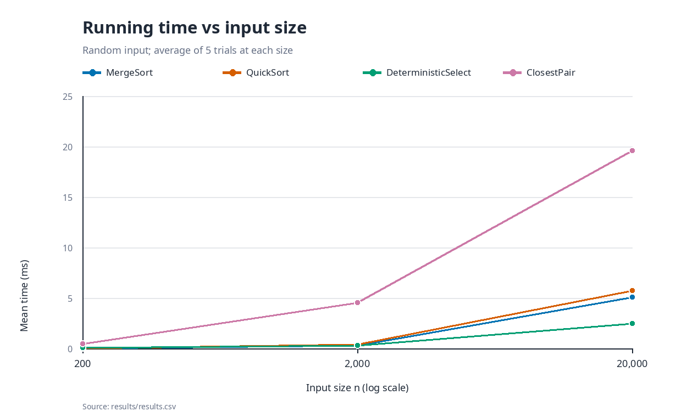
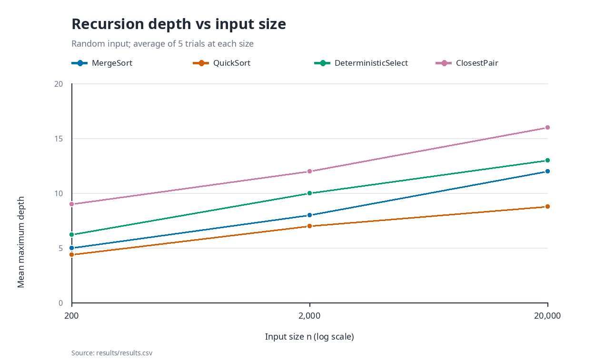
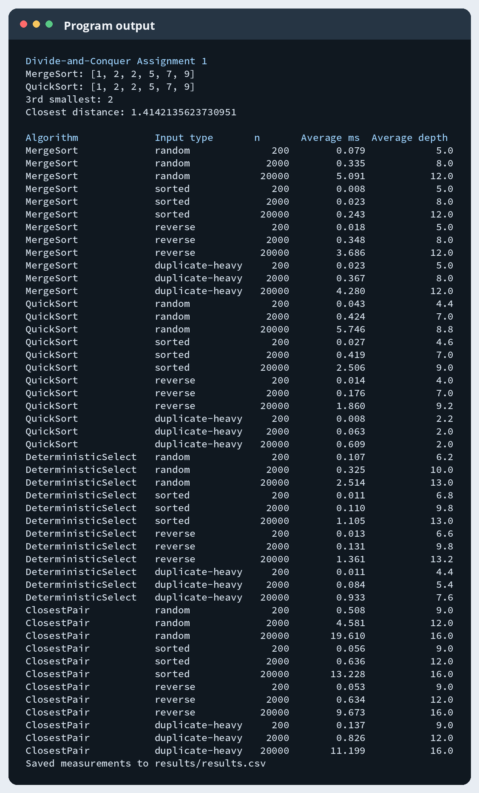
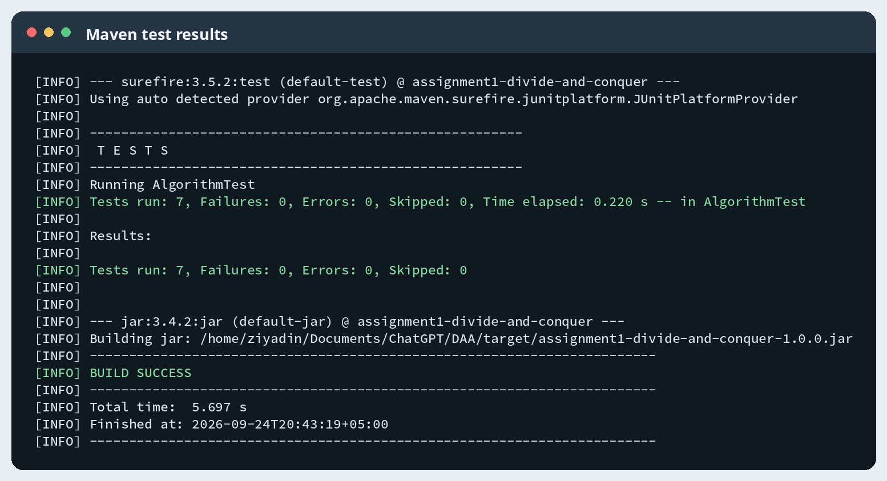
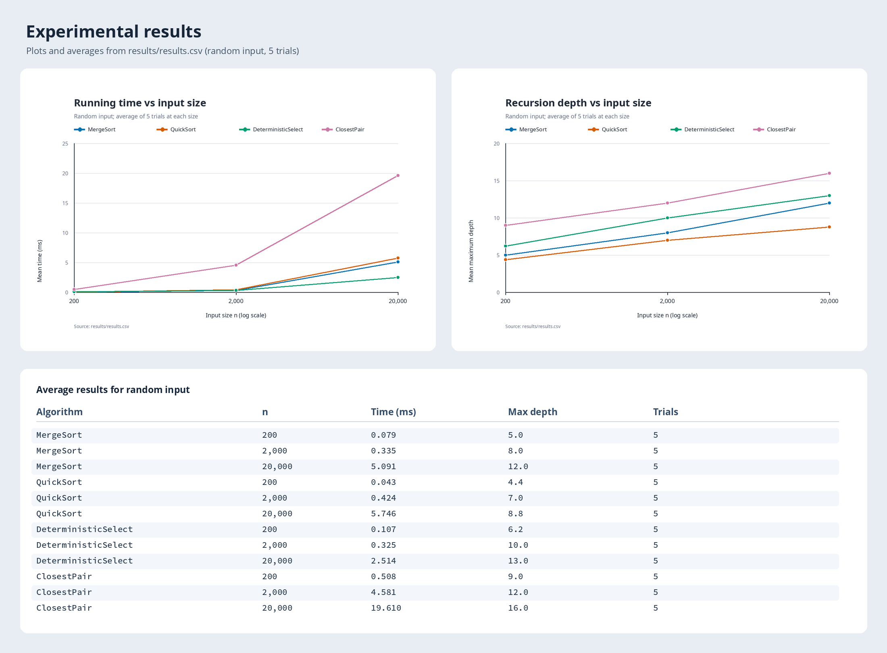

# Assignment 1: Divide-and-Conquer Algorithm Analysis

This project implements four algorithms in Java: MergeSort, randomized QuickSort, deterministic selection, and closest pair of points. I compared their running times, recursion depths, and operation counts on several input sizes and shapes. The full measurements are in [results/results.csv](results/results.csv).

## How to run

Java 17 or newer and Maven are needed.

```bash
mvn test
mvn package
java -jar target/assignment1-divide-and-conquer-1.0.0.jar
```

The tests check sorting against `Arrays.sort`, selection against a sorted copy in 150 random cases, and closest pair against brute force on small sets (including one set of 2,000 points). They also check empty inputs, single items, duplicates, and a large closest-pair input. Running the jar prints a short example and writes `results/results.csv`.

## Algorithm analysis

**MergeSort.** I split the array in half, sort both halves, and merge them with one reusable temporary array. For parts of at most 16 items, I use insertion sort. An already ordered pair of halves does not need merging. The usual recurrence is `T(n) = 2T(n/2) + Θ(n)`, so the Master Theorem gives `Θ(n log n)` time. The temporary array takes `Θ(n)` space and the call stack takes `Θ(log n)`. On a fully sorted array, skipped merges make this implementation closer to linear time.

**QuickSort.** I choose a random pivot and use an in-place three-way partition: smaller, equal, and larger values. I call the function on the smaller side and handle the larger side in a loop. With reasonably balanced splits, `T(n) ≈ 2T(n/2) + Θ(n)`, giving expected `Θ(n log n)` time. A series of very poor pivots can still give `T(n) = T(n-1) + Θ(n) = Θ(n²)`. The smaller-first method keeps the call stack at `O(log n)` even in that case; partitioning itself uses constant extra space.

**Deterministic Select.** This finds the item at a zero-based position `k` without sorting the whole array. It sorts groups of five, selects the median of their medians as the pivot, partitions in place into three sections, and continues only in the section containing `k`. Its worst-case recurrence is `T(n) ≤ T(n/5) + T(7n/10 + O(1)) + Θ(n)`. Since the two recursive fractions add to less than one, the linear partition work dominates, giving `Θ(n)` worst-case time (Akra–Bazzi intuition). It uses `O(log n)` stack space and constant extra array space.

**Closest Pair.** I first sort the points by x-coordinate. The recursive part solves the left and right halves, merges their y-order, and checks nearby points in a strip around the middle. Each strip point needs at most the next seven points checked. The recurrence for the recursive part is `T(n) = 2T(n/2) + Θ(n)`, which is `Θ(n log n)` by the Master Theorem. The first x-sort is also `Θ(n log n)`, so the full algorithm stays `Θ(n log n)`. Its arrays use `Θ(n)` space and recursion uses `Θ(log n)` space.

## Experiments

I used sizes 200, 2,000, and 20,000, with random, sorted, reverse-sorted, and duplicate-heavy inputs. Arrays use only ten different values in the duplicate-heavy case. Duplicate-heavy point sets use a 20 by 20 coordinate grid. For selection, `k = n/2`. The program does one warm-up run per algorithm, then records five trials for each combination. Input generation happens before timing; `System.nanoTime()` measures the algorithm call. The CSV also contains comparisons, array moves, and recursive calls. For closest pair, the comparison count means distance calculations, while its maximum depth includes both the initial x-sort and the closest-pair recursion.

These measurements were made with OpenJDK 25.0.4.1 on an AMD Ryzen 7 5800H computer with 15 GiB RAM. Times below are five-trial averages in milliseconds. Small timings can change noticeably between runs because of JVM compilation and other activity on the computer.

### Average running time (ms)

| Algorithm | Input | 200 | 2,000 | 20,000 |
|---|---|---:|---:|---:|
| MergeSort | random | 0.0786 | 0.3349 | 5.0908 |
| MergeSort | sorted | 0.0080 | 0.0233 | 0.2432 |
| MergeSort | reverse | 0.0184 | 0.3477 | 3.6857 |
| MergeSort | duplicate-heavy | 0.0229 | 0.3668 | 4.2803 |
| QuickSort | random | 0.0431 | 0.4243 | 5.7456 |
| QuickSort | sorted | 0.0271 | 0.4187 | 2.5056 |
| QuickSort | reverse | 0.0136 | 0.1761 | 1.8595 |
| QuickSort | duplicate-heavy | 0.0076 | 0.0626 | 0.6094 |
| Deterministic Select | random | 0.1068 | 0.3252 | 2.5143 |
| Deterministic Select | sorted | 0.0113 | 0.1098 | 1.1053 |
| Deterministic Select | reverse | 0.0127 | 0.1310 | 1.3612 |
| Deterministic Select | duplicate-heavy | 0.0111 | 0.0838 | 0.9332 |
| Closest Pair | random | 0.5078 | 4.5808 | 19.6097 |
| Closest Pair | sorted | 0.0556 | 0.6361 | 13.2281 |
| Closest Pair | reverse | 0.0534 | 0.6337 | 9.6725 |
| Closest Pair | duplicate-heavy | 0.1365 | 0.8263 | 11.1990 |

### Average maximum recursion depth

Depth is the deepest active call, not the total number of calls. Decimal values mean the maximum varied across the five trials.

| Algorithm | Input | 200 | 2,000 | 20,000 |
|---|---|---:|---:|---:|
| MergeSort | random | 5.0 | 8.0 | 12.0 |
| MergeSort | sorted | 5.0 | 8.0 | 12.0 |
| MergeSort | reverse | 5.0 | 8.0 | 12.0 |
| MergeSort | duplicate-heavy | 5.0 | 8.0 | 12.0 |
| QuickSort | random | 4.4 | 7.0 | 8.8 |
| QuickSort | sorted | 4.6 | 7.0 | 9.0 |
| QuickSort | reverse | 4.0 | 7.0 | 9.2 |
| QuickSort | duplicate-heavy | 2.2 | 2.0 | 2.0 |
| Deterministic Select | random | 6.2 | 10.0 | 13.0 |
| Deterministic Select | sorted | 6.8 | 9.8 | 13.0 |
| Deterministic Select | reverse | 6.6 | 9.8 | 13.2 |
| Deterministic Select | duplicate-heavy | 4.4 | 5.4 | 7.6 |
| Closest Pair | random | 9.0 | 12.0 | 16.0 |
| Closest Pair | sorted | 9.0 | 12.0 | 16.0 |
| Closest Pair | reverse | 9.0 | 12.0 | 16.0 |
| Closest Pair | duplicate-heavy | 9.0 | 12.0 | 16.0 |





## Discussion

1. **Do the results match the theory?** Broadly, yes. As `n` grows, MergeSort, QuickSort, and Closest Pair stay practical at 20,000 items, while selection needs less work because it searches only one side. Random selection took 0.3252 ms at 2,000 items and 2.5143 ms at 20,000 items. The short runs are too noisy to use as exact proofs of a growth rate.
2. **How does input structure matter?** Sorted input helps this MergeSort because it can skip merges: at 20,000 items it took 0.2432 ms, compared with 5.0908 ms on random input. QuickSort's random pivot prevents a sorted input from always choosing a bad partition. Its three-way partition is especially useful for duplicates: the 20,000-item duplicate-heavy case took 0.6094 ms and reached depth 2. Point order also affects the initial x-sort, even though all point sets are sorted inside the algorithm.
3. **Why recurse on QuickSort's smaller side?** Each real recursive call handles at most half of the current partition. The larger side is handled by the loop, so the number of active calls remains logarithmic. This limits stack use even if the partition sizes are uneven.
4. **Why is Median-of-Medians linear in the worst case?** A median from groups of five gives a pivot with a guaranteed number of values on both sides. After the pivot is found, the algorithm needs to search at most about 70% of the array. Three-way partitioning also removes all values equal to the pivot at once. The total work across the recursive sizes is therefore `O(n)`.
5. **Why is Closest Pair faster than brute force on large inputs?** Brute force checks every pair, which means about 200 million pairs for 20,000 points. Divide and conquer checks only a small number of strip neighbors after solving each half. The random 20,000-point run averaged 25,845 distance calculations, although sorting and merging add other work not included in that count.
6. **What practical factors affect the results?** JVM warm-up and JIT compilation, memory cache behavior, garbage collection, random pivot choices, and background computer activity can all change times. This program uses one warm-up and five trials, so the tables show a useful comparison but are not a precise benchmark. For example, the first random Closest Pair cases include more warm-up effects than later cases.

## Reflection

This assignment helped me connect the recurrence equations to what the program actually does. The recursion-depth measurements were useful because they showed why using a loop for QuickSort's larger side matters. I also saw that an optimization like skipping an unnecessary merge can make sorted input much faster than the general `n log n` bound suggests.

The hardest parts were keeping selection's partitions correct with duplicate values and maintaining y-order during Closest Pair recursion. Comparing with `Arrays.sort` and a simple brute-force distance method made those mistakes easier to find. Timing was less straightforward than correctness because very short Java runs vary from trial to trial.

## Screenshots

**Program output**



**Test results**



**Plots and CSV results**


